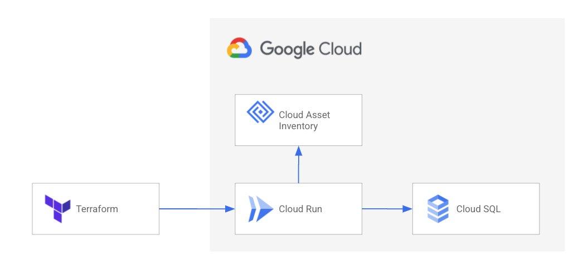
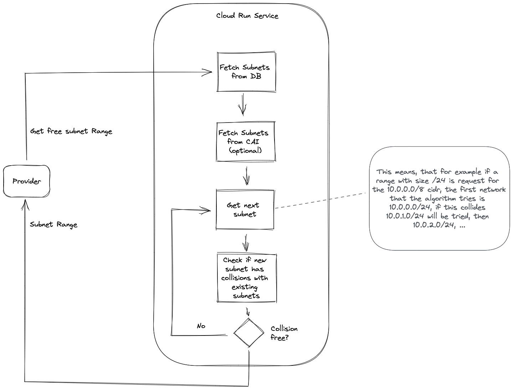

# IPAM Autopilot
IPAM Autopilot is a simple Docker Container and Terraform provider that allows you to automatically manage IP ranges for GCP VPCs.

It connects to Cloud Asset Inventory to also retrieve already existing subnets and ranges, in order to allow for a mixed usage.



IPAM Autopilot consists of three parts:
  * [container image](./container) that provides a REST API
  * [terraform module](./terraform-module) which implements backend service infrastructure required to host container image
  * [terraform provider](https://registry.terraform.io/providers/openx/gcp-ipam-autopilot) which implements integration between terraform and backend service

The provider uses application default credentials to authenticate against the backend. Alternatively you can directly provide an identity token via the `GCP_IDENTITY_TOKEN` environment variable to access the Cloud Run instance, the audience for the identity token should be the domain of the Cloud Run service.

## IPAM Autopilot Backend
The [terraform-module](./terraform-module) folder contains terraform module with which the IPAM Autopilot backend can be deployed to CloudRun. The required APIs are created during the deployment. The deployment instructions also provision a small CloudSQL instance. 

The following GCP services are used as part of the deployment, and might trigger some charges to your account:
  * [Cloud Run](https://cloud.google.com/run)
  * [CloudSQL](https://cloud.google.com/sql)
  * [Secret Manager](https://cloud.google.com/secret-manager)
  * [Cloud Asset Inventory](https://cloud.google.com/asset-inventory)

## End to end deployment

First, create backend service using terraform module:
```
module "gcp_ipam_autopilot" {
  source          = "openx/gcp-ipam-autopilot/terraform-module""
  organization_id = "12345"
  project_id      = "my-ipam-autopilot"
}
```
Then configure terraform provider using value of module output (`module.gcp_ipam_autopilot.outputs.url`) and start allocating allocating subnets:

```terraform
terraform {
  required_providers {
    ipam = {
      version = "~> 0.4"
      source = "openx/gcp-ipam-autopilot"
    }
  }
}

provider "ipam" {
  url = "https://<url returned by module output>"
}

resource "ipam_routing_domain" "test" {
  name = "Test Domain"
}

resource "ipam_ip_range" "main" {
  range_size = 8
  name = "main range"
  domain = ipam_routing_domain.test.id
  cidr = "10.0.0.0/8"
}

resource "ipam_ip_range" "sub1" {
  range_size = 24
  name = "sub range 1"
  domain = ipam_routing_domain.test.id
  parent = ipam_ip_range.main.cidr
  cidr = "10.0.1.0/24"
}

```

## Subnet selection logic


A simple example might shed some light on how the selection works. Let's assume we want a `/24` range in the `10.0.0.0/8` subnet. In the IPAM Autopilot database, the subnets `10.0.0.0/28` and `10.0.0.16/28` are allocated. From Cloud Asset Inventory a VPC with a subnet `10.0.0.64/26` is discovered as well. This means that the subnet `10.0.0.0/24` will collide with this subnets, so IPAM Autopilot will allocate `10.0.1.0/24`.